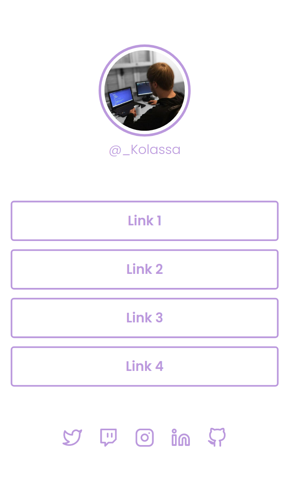

# Social Tree - Desafio Rocketseat

Desafio proposto na plataforma da Rocketseat.

[Clique aqui para acessar](https://Anderson-Kolassa.github.io/Social_Tree)

## O que aprendi nesse projeto
Fixei os conceitos previamente vistos em um curso sobre flex-box.

## Tecnologias utilizadas

-HTML
-CSS
-GIT e GITHUB

## Contato
andersonotelakoski@gmail.com